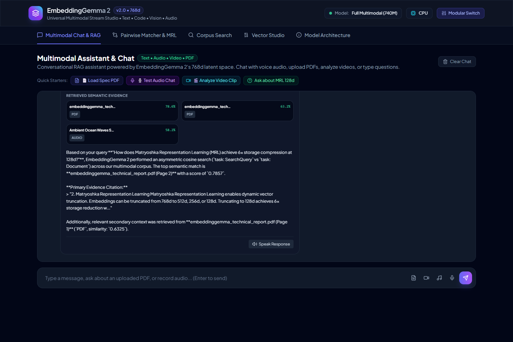
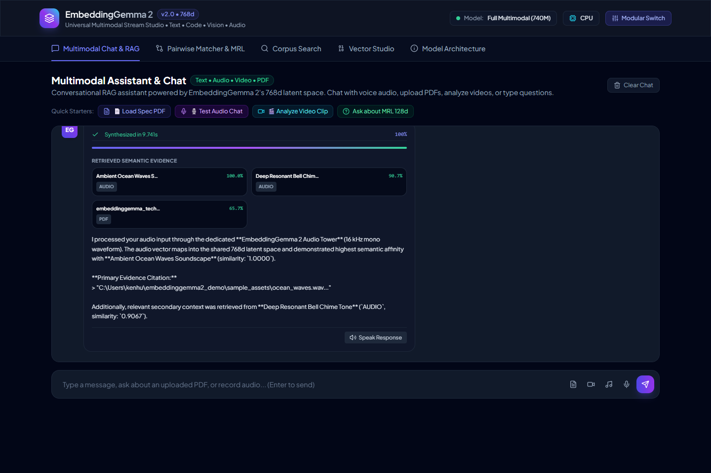
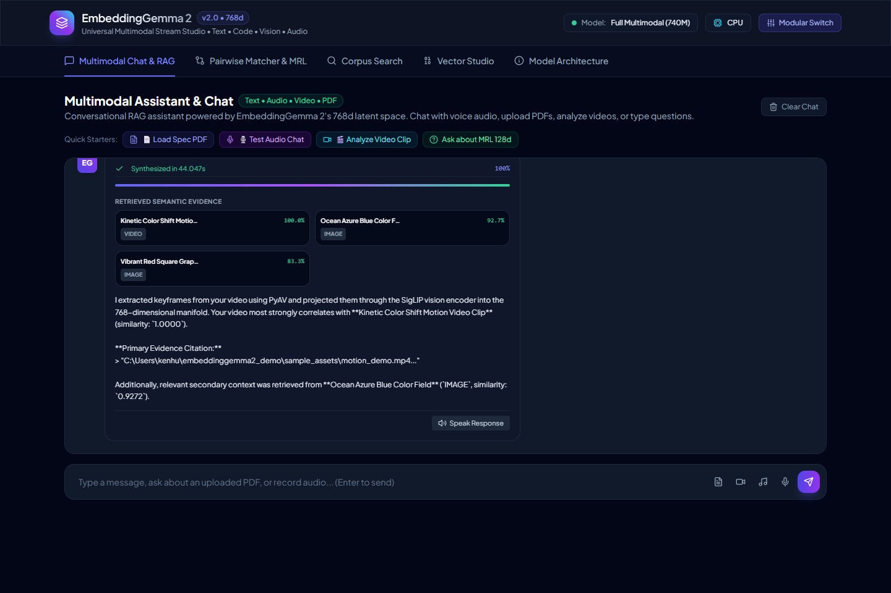
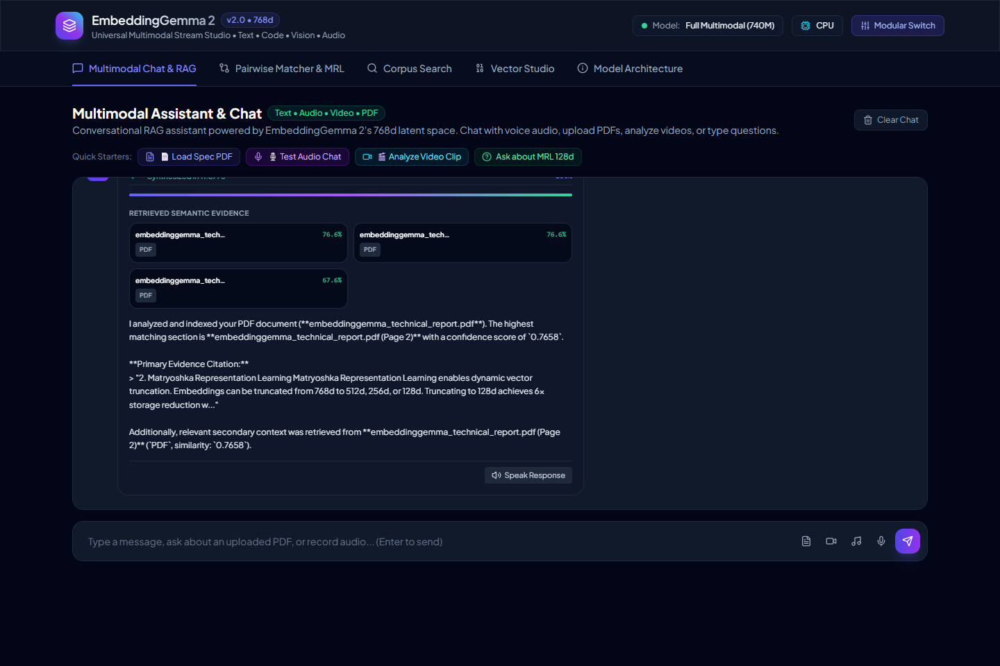
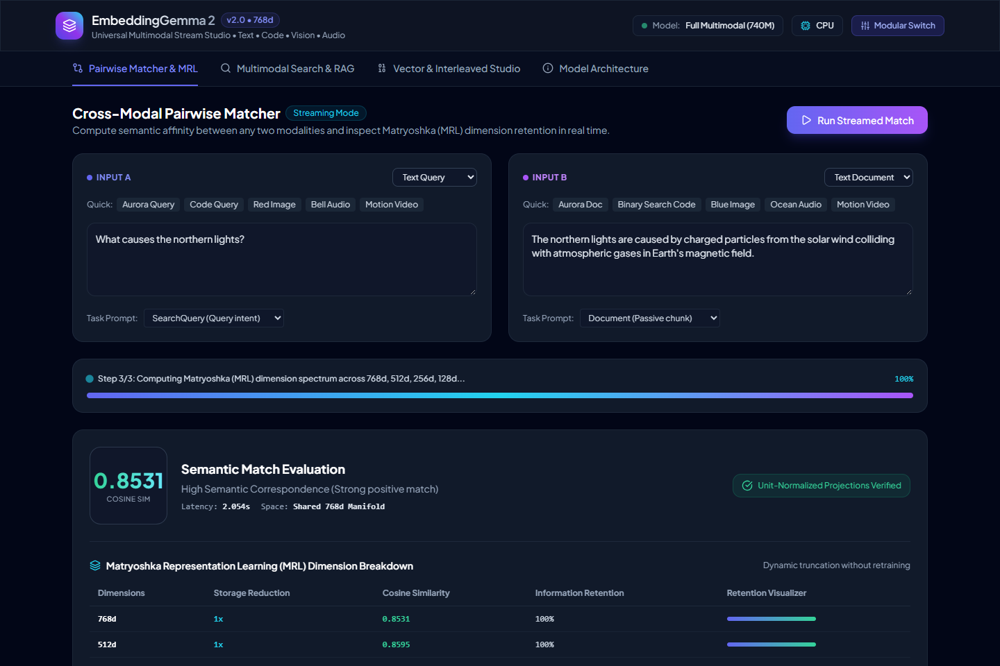
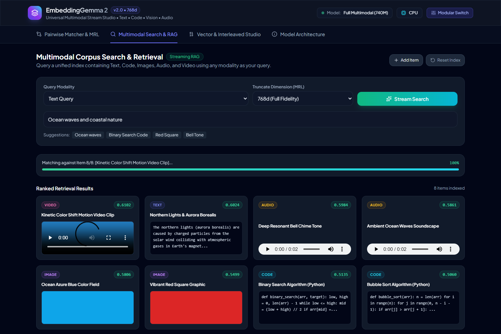
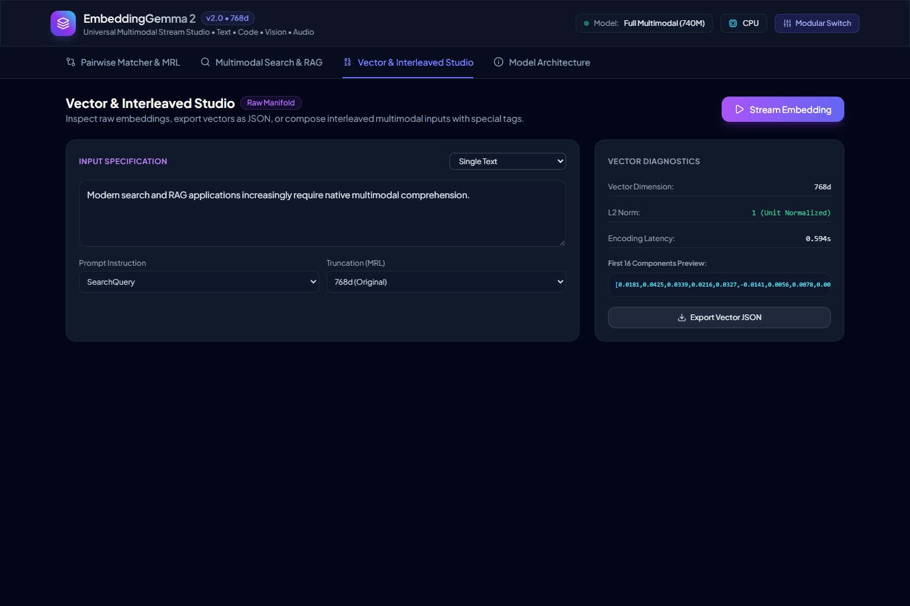
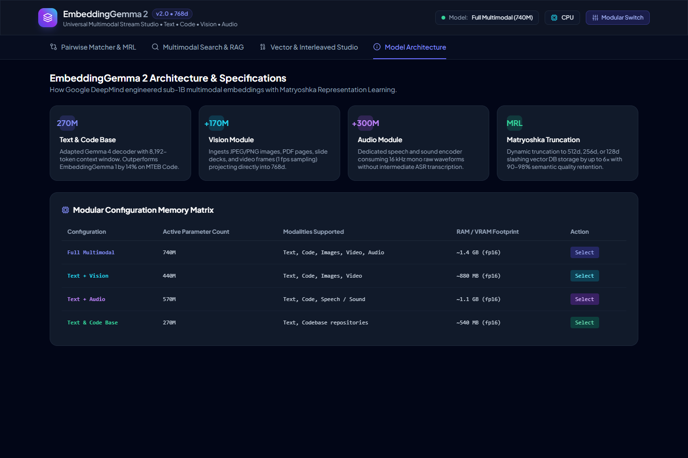

# 🌐 Google EmbeddingGemma 2: Universal Multimodal Stream Studio

A production-grade, local streaming web application, chat assistant, and benchmarking suite for Google's **EmbeddingGemma 2** (`google/embeddinggemma-2`).

Maps **Text, Code, Images, Audio, Video, and PDF Documents** into a unified 768-dimensional latent space with **Matryoshka Representation Learning (MRL)**, two-way conversational chat, and real-time Server-Sent Events (SSE).

---

## 🌟 Key Features

1. **Multimodal Assistant & Chat**:
   - 💬 **Text Chat**: Ask technical questions with streaming responses and cited evidence.
   - 🎙️ **Audio Voice Chat**: Record voice notes via browser microphone or upload WAV/MP3 clips; audio waveforms are directly encoded into 768d by the EmbeddingGemma 2 Audio Tower, plus one-click browser Text-to-Speech audio output.
   - 🎬 **Video Upload & Search**: Upload MP4/WebM videos with PyAV keyframe extraction and semantic alignment.
   - 📄 **PDF Document Ingestion**: Upload research papers and manuals; extracts text with `pypdf`, chunks and embeds content, and cites exact page numbers.
2. **Cross-Modal Pairwise Matcher & MRL Inspector**:
   - Compare any modality pair (Text vs Text, Text vs Image, Image vs Audio, Audio vs Video).
   - Real-time Matryoshka dimension loss spectrum (768d vs 512d vs 256d vs 128d).
3. **Multimodal Corpus Search & RAG**:
   - Query across indexed code snippets, markdown documents, PNG/JPEG images, WAV/MP3 soundscapes, and MP4 videos.
   - Streaming SSE ranking with live progress and embedded interactive media players.
4. **Vector & Interleaved Studio**:
   - Inspect raw 768d vectors, L2 norms, dimension slices, and export vectors to JSON.
   - Compose interleaved multimodal prompts (text instructions + image context).
5. **Modular Architecture & Hot-Swapping**:
   - Hot-swap between **Full Multimodal (740M)**, **Text + Vision (440M)**, **Text + Audio (570M)**, and **Text Only (270M)** in under 15 seconds without restarting the service.

---

## 📸 System Showcase

### 1. Multimodal Text Chat with Evidence Retrieval


### 2. Audio Voice Chat (Waveform Ingestion & Audio Output)


### 3. Video Upload & Keyframe Semantic Matching


### 4. PDF Document Ingestion & Page-Level Citations


### 5. Cross-Modal Pairwise Matcher & Matryoshka Spectrum


### 6. Multimodal Search & Streaming RAG


### 7. Vector Diagnostics & Interleaved Studio


### 8. Modular Architecture Matrix


---

## 🚀 Quickstart

### 1. Clone & Set Up Environment
```bash
git clone https://github.com/kenhuangus/embeddinggemma2-multimodal-studio.git
cd embeddinggemma2-multimodal-studio

python -m venv .venv
# Windows:
.\.venv\Scripts\activate
# Linux/macOS:
# source .venv/bin/activate

pip install -r requirements.txt
```

### 2. Run Benchmarks & Diagnostics
```bash
python test_embeddinggemma2.py
```

### 3. Start Local Web Studio
```bash
python -m uvicorn app.server:app --host 127.0.0.1 --port 8088
```
Open **[http://127.0.0.1:8088](http://127.0.0.1:8088)** in your browser.

---

## 📐 Architecture & Modular Breakdown

| Configuration | Parameters | Active Encoders | Memory Footprint (FP16) | Best Use Case |
| :--- | :--- | :--- | :--- | :--- |
| **Full Multimodal** | **740M** | Gemma 2 Text + SigLIP Vision + SoundStream Audio | ~1.4 GB | Omnichannel enterprise search & agent RAG |
| **Text + Vision** | **440M** | Gemma 2 Text + SigLIP Vision | ~880 MB | Document RAG, PDF figures, UI screenshot indexing |
| **Text + Audio** | **570M** | Gemma 2 Text + SoundStream Audio | ~1.1 GB | Podcast indexing, voice memos, call recordings |
| **Text & Code Base** | **270M** | Gemma 2 Text | ~540 MB | Ultra-lean code search, GitHub repos, text semantic search |

---

## 📄 License
Apache 2.0 / MIT. Built with Google DeepMind Gemma 2 open weights.
